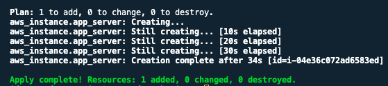
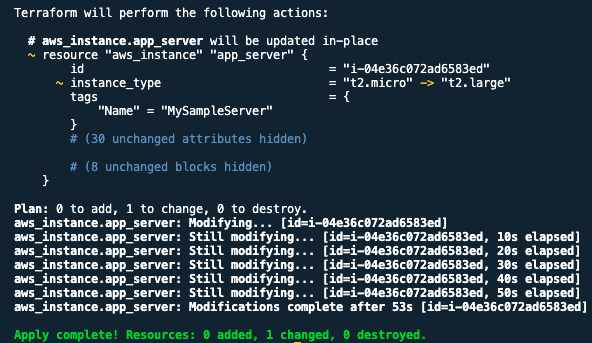
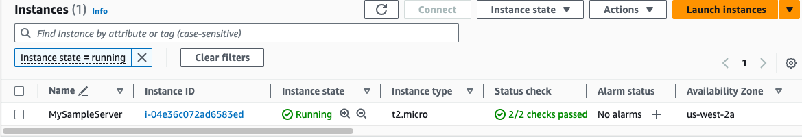
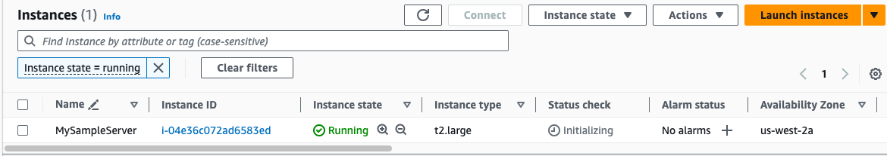

# Terraform Basics

**Table of Contents**

- [Create an AWS resource](#create-an-aws-resource)
  - [Create an AWS account](#create-an-aws-account)
  - [Create an AWS IAM User](#create-an-aws-iam-user)
  - [Generate AWS Credentials](#generate-aws-credentials)
  - [Configure AWS CLI](#configure-aws-cli)
  - [Install AWS CLI](#install-aws-cli)
  - [Confirm AWS Credentials](#confirm-aws-credentials)
- [Terraform Commands](#terraform-commands)
  - [Initialize Project](#initialize-project)
  - [Format Terraform file](#format-terraform-file)
  - [Validate Terraform File](#validate-terraform-file)
  - [Infrastructure Overview](#infrastructure-overview)
  - [Create/Update Infrastructure](#create-update-infrastructure)
  - [Terraform State File](#terraform-state-file)
  - [Terraform Refresh](#terraform-refresh)
  - [Terraform Output](#terraform-output)
- [Declaring a Variable](#declaring-a-variable)
  - [Input Variable](#input-variable)
  - [TFVARS file](#tfvars-file)
- [Local Values](#local-values)
- [Output Values](#output-values)
- [Extras](#extras)

## Create an AWS resource

### Create an AWS account

You will have to create an AWS account if you don't have any.

### Create an AWS IAM User

Create an IAM user that will be used for the entire study.

**BEST PRACTICE** - Avoid using the `root` account to perform tasks on AWS. It is recommended to create an IAM user for those tasks.

For the entirety of this study, I will create an IAM user with `AdministratorAccess`.

- With this permission, I still have almost all the privileges that the **root** account has.

**BEST PRACTICE** - Users should be only assigned the least privilege they need to perform their job functions.

### Generate AWS Credentials

As the new user, generate an `AWS ACCESS KEY` and `AWS SECRET ACCESS KEY`. These credentials are what you use to interact with AWS API in the CLI.

**Note:** The `AWS SECRET ACCESS KEY` vanishes after creation. So be sure to copy that and save it somewhere no one has access to or simply download the file that was generated for you.

### Configure AWS CLI

In your computer, export the credentials you just generated into your **Terminal**.

- In your **Terminal**, open the file `~/.aws/credentials` to add the credentials

```bash
[default]
region=us-west-2  # whatever region is closest to you
aws_access_key_id=YOUR_OWN_ACCESS_KEY
aws_secret_access_key=YOUR_OWN_SECRET_ACCESS_KEY
```

To confirm your credentials are set, you need to use the AWS CLI to make that confirmation. But first, it has to be installed.

### Install AWS CLI

Refer to this page for step by step instructions on how to do the installation.

[AWS CLI Install](https://docs.aws.amazon.com/cli/latest/userguide/getting-started-install.html)

### Confirm AWS Credentials

After installation, let's confirm our credentials were properly set.

```bash
# check the ACCESS KEY & SECRETS are correct
aws configure list

# confirm the credentials work
aws sts get-caller-identity
```

If everything checks out, let's go back to configuring our terraform script to provision an EC2 instance.

Remember that whatever `AMI` you are using for your EC2 instance has to be from the same region you configured in your credentials file.

- AMI's are **region** specific.

## Terraform Commands

### Initialize Project

To initialize our terraform project, we need to run the `init` command:

```bash
terraform init
```

This command technically pulls/downloads all the providers (plugins) and modules defined in the project. After this command ran successfully, you should now see a `.terraform` folder and a `.terraform.lock.hcl` file.

- The `.terraform.lock.hcl` file is a dependency lock file that records specific versions of modules and/or providers being used.

### Format Terraform file

To format your configuration file to follow a consistent style.

```bash
terraform fmt
```

If your configuration file don't follow the standard way of writing terraform, then this command makes that adjustment by adding proper indentation and styling to the file.

### Validate Terraform File

To know if your configuration file is valid and there are no syntax errors or issues, like let's say having the wrong attributes for a resource, this command checks for all those issues for you.

```bash
terraform validate
```

It simply ensures your file contains the required fields and are of the correct type.

**Note:** This command only checks for the presence of required attributes in your code but doesn't validate the value of your attributes.

### Infrastructure Overview

To generate an execution plan that shows what changes will be made to your infrastructure, use this command:

```bash
terraform plan
```

To see the overview of infrastructure changes, you use the `plan` command.

### Create/Update Infrastructure

To apply the changes defined in your execution plan which could be create, modify or destroy, run this command:

```bash
terraform apply
```

This command still generates an execution plan but this time it asks if you like those changes and will like to apply them. You apply them by simply typing `yes`. Any other command terminates the execution.

Assuming that's the only resource you created, you should have something like this after your EC2 instance successfully deployed.



From your study so far, I know you've come across the word `Idempotent` which means that no matter how many times I execute the `terraform apply` command, there will still be only `1` instance because that's what was specified in our configuration file.

Now if we make an update to that resource parameter, it simply stops the resource and update it with whatever changes we made to the old resource. For example,

- We decide to change the `instance type` of our EC2 from `t2.micro` to `t2.large`
- That instance is stopped for the new changes to be made
- Though that sounds good, beware, there will still be an interruption of your service



**Before**


**After**


**Important:** After your first `apply`, take note of the `terraform.tfstate` file. That's your state file that manages your infrastructure. This file should not be tampered with except by an expert that knows what he/she is doing.

### Terraform State File

This is simply like a blueprint or record of your infrastructure. It's a crucial part of Terraform's operation. Here's what the terraform state file does:

- It keeps track of what resources Terraform has created in your cloud environment, like servers, databases, and networks
- It records the current status of your infrastructure. This means it knows what's already there and what changes Terraform has made
- It helps Terraform understand the relationships between resources. For example, if you have a web server that relies on a database, the state file keeps that information
- When you run Terraform commands like `apply` or `destroy`, the state file is used to synchronize the real-world state of your infrastructure with your configuration.
- It ensures that you don't accidentally delete or modify resources outside of Terraform, as it might not be aware of those changes.

In essence, the Terraform state file is a critical record-keeping tool that allows Terraform to manage and maintain your cloud infrastructure according to your desired configuration.

### Terraform Refresh

This command simply updates the state file with the real-world state of the infrastructure. Doesn't do anything major.

```bash
terraform refresh
```

### Terraform Output

This command simply displays the values of output variables you have defined in your configuration file.

```bash
terraform output

# to retrieve a specific output
terraform output instance_ip_addr
```

**Note:** When you update the name of your output and do a `terraform refresh`, terraform gives you both the new one and the old one even if it longer exists. To fix this, simply run `terraform apply` to remove the old one.

### Terraform Destroy

This command is used to tear down and remove the infrastructure that Terraform has provisioned.

```bash
# common way to do it
terraform destroy
terraform destroy -auto-approve

# an alternative
terraform apply -destroy
```

**Note:** It's important to note that running terraform destroy is a critical operation, as it irreversibly removes infrastructure. Care should be taken, especially in production environments, to avoid accidental data loss or service disruptions. Always review the execution plan and be certain of the consequences before confirming the destruction of resources.

## Declaring a Variable

This is a way to store and manage data that can be used in your infrastructure-as-code (IaC) configuration. It's like a placeholder for information that your Terraform configuration might need. [Read more](https://developer.hashicorp.com/terraform/language/values/variables)

### Input Variable

Use the `variable` block to declare an input variable.

```bash
variable instance_type {
  type = string
}
```

When using the input varibale, you will need to provide the input when running terraform commands by using the `-var` flag. This enables you to customize your infrastructure.

There's also another way to pass that input to terraform without adding the `-var` flag. You will need to add that input value to a `terraform.tfvars` file.

### TFVARS file

To set lots of variables, it is more convenient to specify their values in a variable definitions file (with a filename ending in either `.tfvars` or `.tfvars.json`) and then specify that file on the command line with `-var-file` flag if the filename is not `terraform.tfvars`.

If the file is named `terraform.tfvars`, by default terraform detects the file saving you from using the flag to specify the file.

## Local Values

Local values are like named placeholders for expressions within your Terraform configuration. These are the uses of a local value:

- They are used to assign a name to an expression, making it easier to reference that expression multiple times in your configuration
- They help reduce code duplication by allowing you to define complex expressions or calculations once and then use them wherever needed
- Local values make your configuration more readable and understandable by giving meaningful names to complex or frequently used values
- When you need to update an expression or value, you only need to do it in one place (the local value definition), ensuring consistency.
- They are scoped within the module, which means they are available for use only within that module.

In essence, local values simplify your configuration by providing a way to name and reuse expressions, promoting clean and maintainable code. [Read more](https://developer.hashicorp.com/terraform/language/values/locals)

Here's an example of a code block:

```bash
locals {
  project_name = "Dah_Queen"
}

resource "aws_instance" "app_server" {
  ami           = var.my_ami
  instance_type = var.instance_type

  tags = {
    Name = "${local.project_name}'s-Server"
  }
}
```

## Output Values

Output values are like the results or information that Terraform provides after it has executed its configuration. They serve the following purposes:

- They allow you to share specific information about your infrastructure with other parts of your system or users
- They provide a way to communicate what Terraform has created or configured, like the IP address of a server, the URL of a load balancer, or any other relevant data
- They can be used to extract and display important details that you might need for interacting with or managing your infrastructure
- They can be accessed externally, which means you can retrieve this information and use it in scripts, documentation, or any other tools
- They are often used for documenting the results of your Terraform configuration

In essence, output values are a way to retrieve and make use of essential information about your infrastructure that Terraform has provisioned or modified. [Read more](https://developer.hashicorp.com/terraform/language/values/outputs)

Here's an example of a code block:

```bash
resource "aws_instance" "app_server" {
  ami           = var.my_ami
  instance_type = var.instance_type

  tags = {
    Name = "${local.project_name}'s-Server"
  }
}

output instance_ip_addr {
  value = aws_instance.app_server.public_ip
}
```

After adding your `output`s, since nothing changed in the infrastructure, just run a `terraform refresh` to refresh the state of your infrastructure.

- Now you should see your outputs
- Also if you type `terraform output`, you will get same results as well

## Modules

Terraform modules are reusable pieces of Terraform code that can be used to create and manage infrastructure. They are like Lego bricks that you can snap together to build different things. [Read more](https://developer.hashicorp.com/terraform/language/modules)

For example, you could have a module for creating a web server, a database, or a load balancer. You could then use these modules in your own Terraform configuration to create the infrastructure for your application.

Here is a simple example of a Terraform module for creating a web server instance in AWS:

```bash
module "web_server" {
  source = "./web_server"

  # Set the name of the web server
  name = "my-web-server"

  # Set the size of the web server instance
  instance_type = "t2.micro"
}
```

**Remember:** When you add a `module` to your Terraform code, you have to always run `terraform init` to install the necessary module into your project.

Terraform modules are a great way to reuse code and make your Terraform configuration more modular and reusable. They can also help you to keep your code **DRY (Don't Repeat Yourself)**.

Here are some of the benefits of using Terraform modules:

- **Reusability:** Modules can be reused in multiple Terraform configurations, which saves you time and effort.
- **Modularity:** Modules make your Terraform configuration more modular and reusable, which makes it easier to maintain and update.
- **DRY:** Modules help you to avoid repeating yourself in your Terraform configuration, which makes your code more concise and easier to read.

## Terraform Alias - Provider Configuration

A Terraform alias for a provider is a shortcut that you can use to refer to a specific provider configuration.

For example, you could create an alias for the AWS provider configuration that manages resources in the `us-east-1` region. You could then use this alias to manage resources in that region without having to specify the full provider configuration name each time. [Read more](https://developer.hashicorp.com/terraform/language/providers/configuration)

To create a Terraform alias for a provider, you use the `alias` keyword in the provider block. For example, the following code creates an alias for the AWS provider configuration that manages resources in the `us-west-2` region:

```bash
provider "aws" {
  region = "us-east-1"
}
```

Additional provider configuration for west coast region; resources can reference this as `aws.west`.

```bash
provider "aws" {
  alias  = "west"
  region = "us-west-2"
}
```

### Referring to Alternate Provider Configurations

To use an alternate provider configuration for a resource or data source:

```bash
resource "aws_instance" "foo" {
  provider = aws.west

  # ...
}
```

To select alternate provider configurations for a module, use its `providers` meta-argument to specify which provider configurations to use:

```bash
module "aws_vpc" {
  source = "./aws_vpc"
  providers = {
    aws = aws.west
  }
}
```

## Troubleshooting Out of Scope Infrastructure

I created a `VPC` out of the scope of my terraform infrastructure and later on I wanted Terraform to start managing it for me, like destroying it when I no longer need it.

First, I have to import the resource into Terraform state, so it begins managing it.

Here's the command I used to achieve that:

```bash
# Import the VPC
terraform import module.vpc.aws_vpc.this vpc-00b882ff60ac022ab

# Plan the import
terraform plan

# Apply the import
terraform apply
```

## Terraform Workspace

The `workspace` command is used in Terraform to manage multiple workspaces within a single configuration. Workspaces allow you to maintain different instances of your infrastructure, such as **development**, **sandbox**, and **production**, within the same Terraform configuration files.

Here are the key commands associated with `terraform workspace`:

### New Workspace

This command is used to create a new workspace. For example, you might create workspaces named `dev`, `sbx`, and `prd` to represent different environments.

Example:

```bash
terraform workspace new dev
```

### List Workspaces

This command lists all the available workspaces in the current Terraform configuration.

Example:

```bash
terraform workspace list
```

### Select Workspace

This command allows you to switch between different workspaces. You specify the workspace name as an argument.

Example:

```bash
terraform workspace select prd
```

### Show Workspace

This command displays the name of the currently selected workspace.

Example:

```bash
terraform workspace show
```

### Delete Workspace

This command deletes a workspace. Be cautious with this command, as it irreversibly removes the workspace and its associated state.

Example:

```bash
terraform workspace delete sbx
```

Workspaces are particularly useful when you want to maintain separate states for different environments.
Each workspace has its own state file, allowing you to make changes and apply configurations to one environment without affecting others.
This helps in keeping the infrastructure configurations modular and allows for easier management of different deployment scenarios.

## Extras

- [Github Markdown TOC Generator](https://ecotrust-canada.github.io/markdown-toc/)
